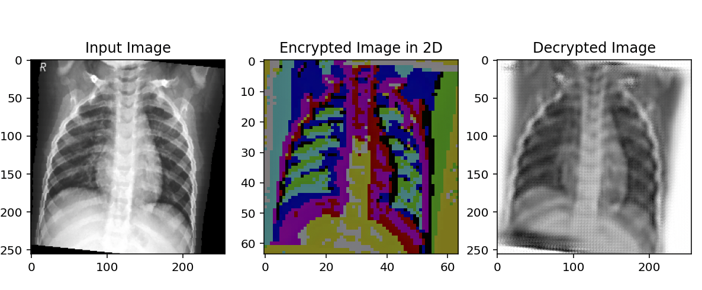

# Deep Learning based Encryption-Decryption using GANs

Asymmetric cryptographic scheme for encryption and decryption of medical images using GANs. 

## Method
- Encode medical images in a 256 dimensional vector space
- Usage of 2 generators and 2 discriminators for high quality decrypted outputs*.
- Cycle consistency losses for effective inverse mapping. 

## Architecture
- Each generator has an autoencoder like architecture, the encoder plays the role of encryption and the decoder plays the role of decryption. 
- 3 Bottleneck residual layers were built between the encoder and decoder. We used only 3 owing to limitations in compute.
- The discriminator contains strided convolutions followed by sigmoid activation on the final layer to classify images as real or fake. 

## Notes
- The models were trained upto only 5 epochs over a 14 hour period locally an Apple M2 Pro with 8 core CPU and 10 core GPU. Further training on better system specs would lead to high quality decrypted outputs.
-  The encrypted output shown was reduced to 3 components using T-SNE and is not the actual cipher text. The displayed output is a method of explainability since it portrays the models ability to learn and encode the input distribution.